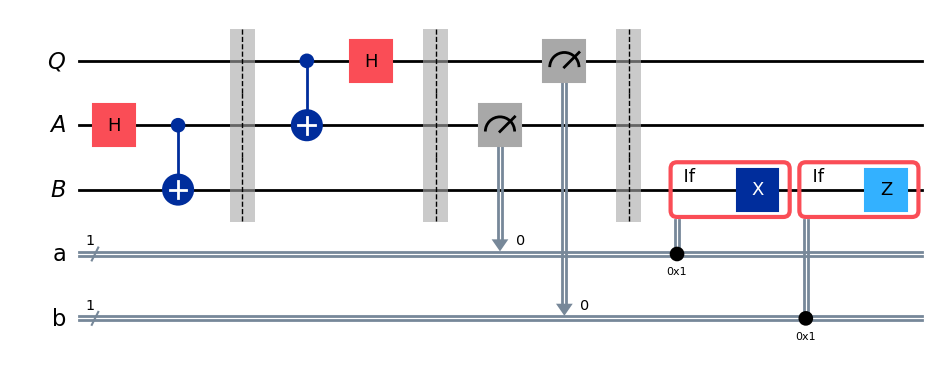
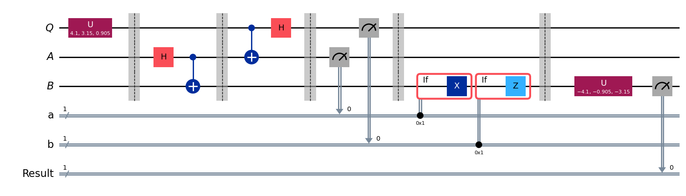

# Quantum State Teleportation: Simulator-to-Hardware Verification with Qiskit

A single-qubit quantum teleportation protocol implemented in Qiskit, verified on the noiseless Aer simulator, and benchmarked on IBM's 156-qubit "Fez" real quantum computer, achieving a 93% experimental success rate against a 100% theoretical baseline.

--

## Table of Contents

- [Overview](#overview)
- [How It Works](#how-it-works)
- [Circuit Diagrams](#circuit-diagrams)
- [Results](#results)
- [Simulator vs. Real Hardware](#simulator-vs-real-hardware)
- [Pros and Cons](#pros-and-cons)
- [Tech Stack](#tech-stack)
- [Project Structure](#project-structure)
- [Key Concepts](#key-concepts)
- [Future Improvements](#future-improvements)
- [License](#license)

---

## Overview

This project implements the **quantum teleportation protocol**. It is the technique by which an unknown quantum state is transferred from one qubit to another using entanglement and classical communication, without physically moving the qubit itself.

A random single-qubit state is generated, teleported from a sender ("Alice") to a receiver ("Bob") using one entangled pair (e-bit) and two classical bits, then verified by applying the inverse of the random gate and checking that the qubit deterministically collapses back to `|0⟩`.

The protocol is tested in two environments:
1. **IBM Aer Simulator** which is an ideal, noiseless backend
2. **IBM Fez** which is a real 156-qubit superconducting quantum processor accessed via IBM Quantum Cloud

## How It Works

1. Alice and Bob share one entangled pair `(A, B)` prepared in the Bell state `|φ+⟩`.
2. Alice holds the unknown qubit `Q` she wants to send to Bob.
3. Alice applies a CNOT (`Q` → `A`) followed by a Hadamard gate on `Q`.
4. Alice measures both `Q` and `A`, producing two classical bits.
5. Alice sends these two classical bits to Bob.
6. Bob conditionally applies an `X` gate (if Alice's measurement 'a' is 1 (a = 1)) and a `Z` gate (if Alice's measurement  'b' is 1(b = 1)) to his qubit.
7. Bob's qubit now holds the exact state that `Q` originally had which means that teleportation has been completed.

Correctness is verified by applying a **random unitary gate** to `Q` before teleportation, then applying its **inverse** to Bob's qubit after teleportation. If the protocol works, the final measurement is `0` with certainty.

## Circuit Diagrams

**Diagram 1 — Core Teleportation Circuit**
Entanglement generation, Alice's Bell-basis operations, measurement, and Bob's conditional corrections (`X`/`Z`).



**Diagram 2 — Verified Teleportation Circuit**
The random test gate applied to `Q`, composed with the teleportation circuit above, followed by the inverse gate and final measurement on Bob's qubit.



## Results

**Graph 1 — Raw Measurement Counts (Aer Simulator, 4096 shots)**
All three classical bits shown. Since the result qubit is deterministic, only outcomes starting with `0` appear.


**Graph 2 — Marginalized Result (Aer Simulator)**
Filtering out Alice's randomly varying classical bits isolates the teleportation outcome: `0` in 100% of 4096 shots.


**Graph 3 — Real Hardware Result (IBM Fez, 156 qubits)**
Same circuit executed on real superconducting quantum hardware.


## Simulator vs. Real Hardware

| Backend | Shots | Correct (`0`) | Success Rate |
|---|---|---|---|
| Aer Simulator (noiseless) | 4096 | 4096 | **100%** |
| IBM Fez (156-qubit, real hardware) | 4096 | 3809 | **~93%** |

The 7% gap on real hardware reflects gate errors, decoherence, and measurement noises e.t.c 
While the simulator has none of these limitations, it is perfect, noise-less backend.

## Pros and Cons

**Pros**
- Clean, well-commented, step-by-step implementation of a foundational quantum communication protocol
- Includes a genuine correctness proof (random-gate-and-inverse trick), not just a demo
- Validated on *both* an ideal simulator and real quantum hardware, with a direct side-by-side comparison
- API credentials are excluded from the notebook, following good security practice for public repos

**Cons**
- Single-qubit teleportation only — does not extend to multi-qubit or entangled-state teleportation
- No formal fidelity/error-mitigation analysis of the hardware noise
- Requires a paid/allocated IBM Quantum Cloud instance to reproduce the real-hardware section

## Tech Stack

- **Python 3.13**
- **Qiskit 2.x** (`qiskit`, `qiskit-aer`, `qiskit-ibm-runtime`)
- **IBM Quantum Cloud** (`ibm_fez`, 156-qubit backend)
- **Google Colab / Jupyter Notebook**

## Project Structure

```
quantum-teleportation/
├── README.md
├── Quantum_Teleportation.ipynb
├── circuit_diagram_1_Teleportation_setup.png
├── circuit_diagram_2_Tested_Teleportation_setup.png
├── graph_1_Aer_simulation.png
├── graph_2_Aer_simulation_using_marginal_distribution.png
└── graph_3_IBM's_Fez_simulation.png
```

# Key Concepts

- **No-Cloning Theorem** — an unknown quantum state cannot be copied, which is why teleportation *moves* the state rather than duplicating it
- **Bell State / Entanglement** — the shared resource (`|φ+⟩`) that makes the protocol possible
- **Classical Communication Requirement** — teleportation cannot happen faster than light, since Bob needs Alice's two classical bits before he can complete the reconstruction
- **Fidelity** — a measure of how close the teleported state is to the original; 100% on the simulator, ~93% on real hardware in this run

## Future Improvements
I will definitely extend this project tp
- Extend to multi-qubit / entangled-state teleportation across processor


## License

This project is open-sourced under the [MIT License](LICENSE).

---
